## 10. Process Flows (FL-01 … FL-20)

Convention: rounded node = start/end, diamond = decision, `HITL` = human approval step, `CODE` = deterministic code, `AGENT` = LLM agent step. Every flow lists failure paths. All numeric steps are `CODE`.

### FL-01 Forecast & target calculation (F1a) — Job JOB-02
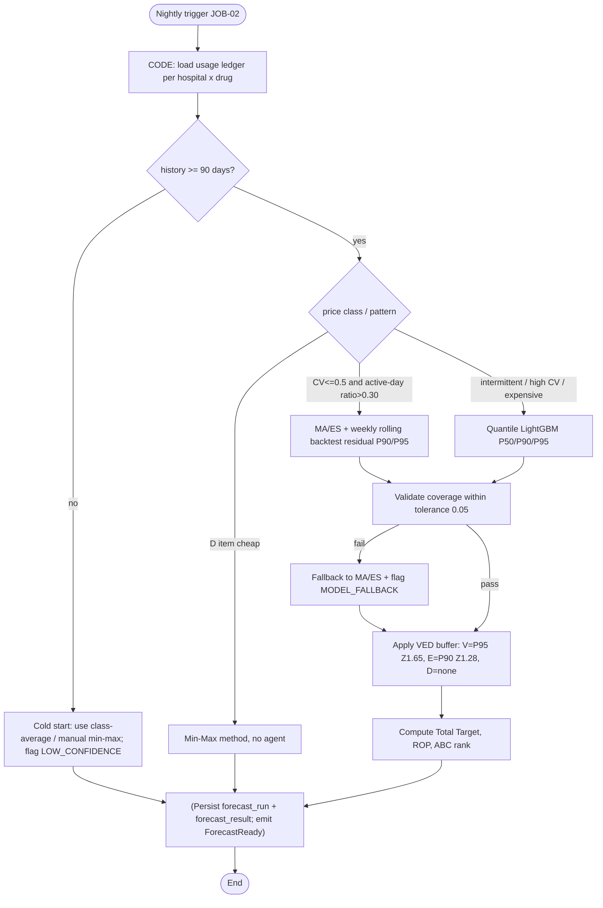
```mermaid
flowchart TD
  A([Nightly trigger JOB-02]) --> B["CODE: load usage ledger per hospital x drug"]
  B --> C{history >= 90 days?}
  C -- no --> C1["Cold start: use class-average / manual min-max; flag LOW_CONFIDENCE"] --> Z
  C -- yes --> D{price class / pattern}
  D -- D item cheap --> M["Min-Max method, no agent"] --> Z
  D -- "CV<=0.5 and active-day ratio>0.30" --> E["MA/ES + weekly rolling backtest residual P90/P95"]
  D -- "intermittent / high CV / expensive" --> F["Quantile LightGBM P50/P90/P95"]
  E --> G["Validate coverage within tolerance 0.05"]
  F --> G
  G -- fail --> H["Fallback to MA/ES + flag MODEL_FALLBACK"] --> I
  G -- pass --> I["Apply VED buffer: V=P95 Z1.65, E=P90 Z1.28, D=none"]
  I --> J["Compute Total Target, ROP, ABC rank"]
  J --> Z["(Persist forecast_run + forecast_result; emit ForecastReady)"]
  Z --> K([End])
```
Failure paths: missing data → skip drug, log `forecast_run_item.status=SKIPPED`; model error → fallback (BR-F1a-0xx); stale (>7 days) → alert evaluator ignores result and raises DATA_STALE.

### FL-02 Stock alert evaluation — JOB-03
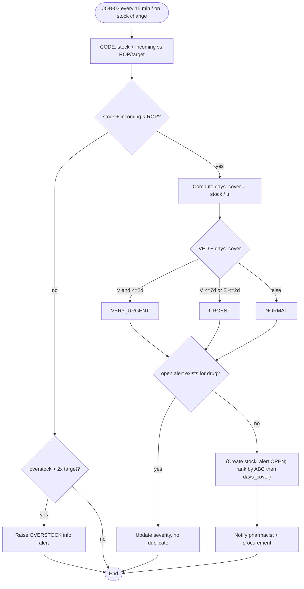
```mermaid
flowchart TD
  A([JOB-03 every 15 min / on stock change]) --> B["CODE: stock + incoming vs ROP/target"]
  B --> C{stock + incoming < ROP?}
  C -- no --> C0{overstock > 2x target?}
  C0 -- yes --> C1["Raise OVERSTOCK info alert"] --> Z
  C0 -- no --> Z([End])
  C -- yes --> D["Compute days_cover = stock / u"]
  D --> E{VED + days_cover}
  E -- "V and <=2d" --> U1["VERY_URGENT"]
  E -- "V <=7d or E <=2d" --> U2["URGENT"]
  E -- else --> U3["NORMAL"]
  U1 & U2 & U3 --> F{open alert exists for drug?}
  F -- yes --> F1["Update severity, no duplicate"] --> Z
  F -- no --> G["(Create stock_alert OPEN; rank by ABC then days_cover)"]
  G --> H["Notify pharmacist + procurement"] --> Z
```

### FL-03 Borrow request creation (F1b)
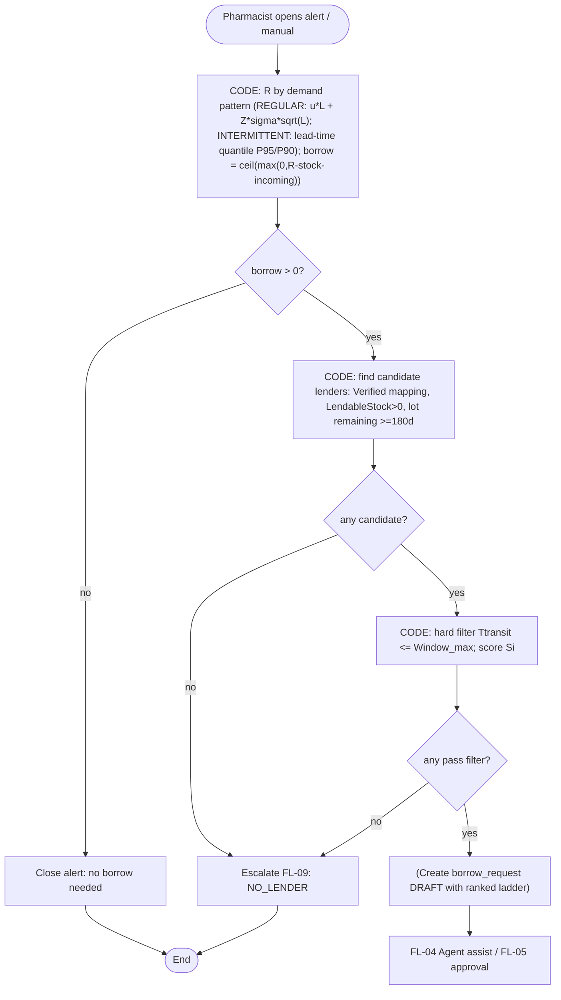
```mermaid
flowchart TD
  A([Pharmacist opens alert / manual]) --> B["CODE: R by demand pattern (REGULAR: u*L + Z*sigma*sqrt(L); INTERMITTENT: lead-time quantile P95/P90); borrow = ceil(max(0,R-stock-incoming))"]
  B --> C{borrow > 0?}
  C -- no --> C1["Close alert: no borrow needed"] --> Z([End])
  C -- yes --> D["CODE: find candidate lenders: Verified mapping, LendableStock>0, lot remaining >=180d"]
  D --> E{any candidate?}
  E -- no --> E1["Escalate FL-09: NO_LENDER"] --> Z
  E -- yes --> F["CODE: hard filter Ttransit <= Window_max; score Si"]
  F --> G{any pass filter?}
  G -- no --> E1
  G -- yes --> H["(Create borrow_request DRAFT with ranked ladder)"]
  H --> I["FL-04 Agent assist / FL-05 approval"]
```

### FL-04 Agent orchestration (F1b, 6 tasks)
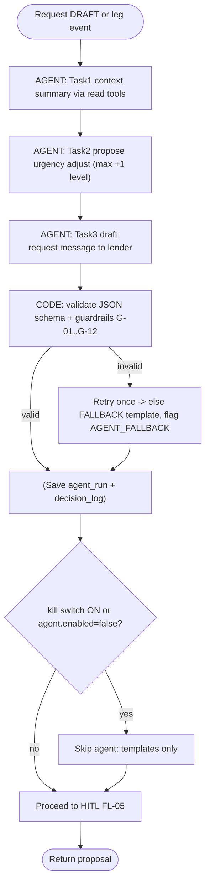
```mermaid
flowchart TD
  A([Request DRAFT or leg event]) --> B["AGENT: Task1 context summary via read tools"]
  B --> C["AGENT: Task2 propose urgency adjust (max +1 level)"]
  C --> D["AGENT: Task3 draft request message to lender"]
  D --> E["CODE: validate JSON schema + guardrails G-01..G-12"]
  E -- invalid --> F["Retry once -> else FALLBACK template, flag AGENT_FALLBACK"]
  E -- valid --> G["(Save agent_run + decision_log)"]
  F --> G
  G --> H{kill switch ON or agent.enabled=false?}
  H -- yes --> I["Skip agent: templates only"]
  H -- no --> J["Proceed to HITL FL-05"]
  I --> J
  J --> K([Return proposal])
```
Later tasks (4 reply interpretation, 5 next-lender proposal, 6 daily summary) run on events from FL-06/08/09 with the same wrapper.

### FL-05 Borrow approval (HITL)
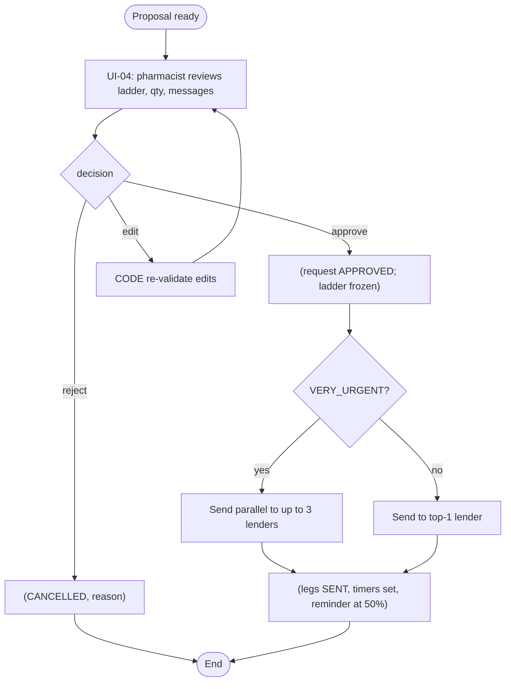
```mermaid
flowchart TD
  A([Proposal ready]) --> B["UI-04: pharmacist reviews ladder, qty, messages"]
  B --> C{decision}
  C -- approve --> D["(request APPROVED; ladder frozen)"]
  C -- edit --> E["CODE re-validate edits"] --> B
  C -- reject --> R["(CANCELLED, reason)"] --> Z([End])
  D --> F{VERY_URGENT?}
  F -- yes --> G["Send parallel to up to 3 lenders"]
  F -- no --> H["Send to top-1 lender"]
  G & H --> I["(legs SENT, timers set, reminder at 50%)"]
  I --> Z
```
Approval of the ladder covers later rounds (ASM-10); changing quantity beyond ladder requires re-approval.

### FL-06 Lender response handling
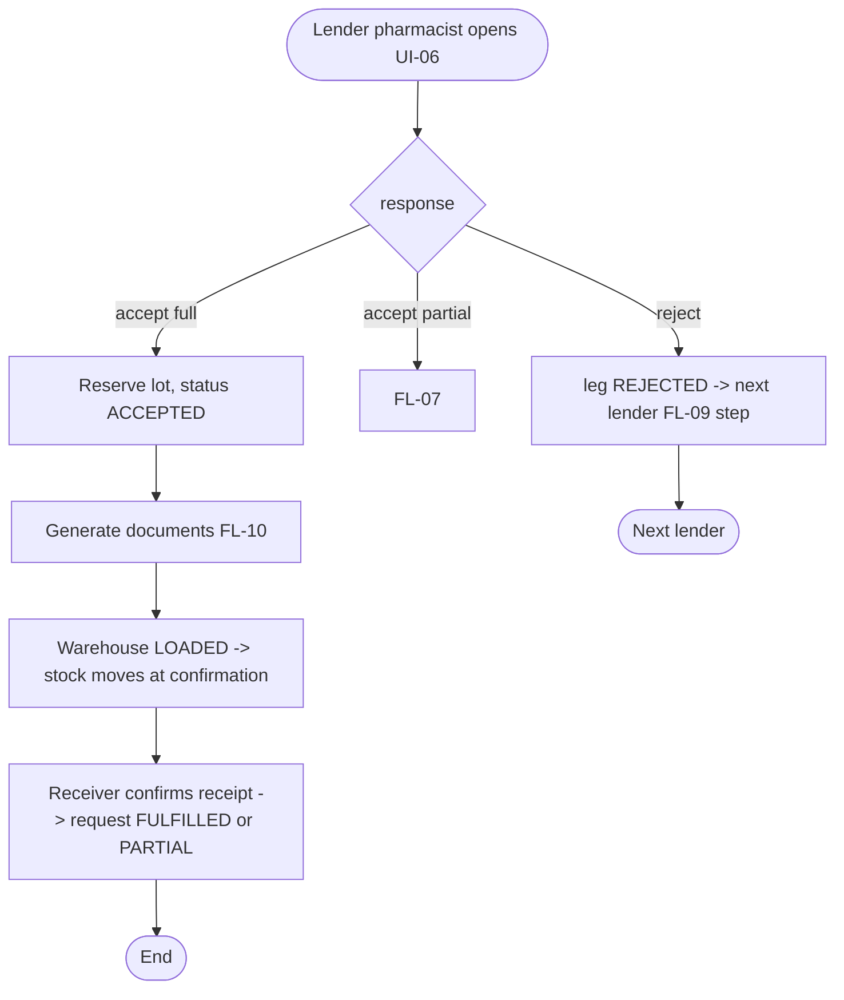
```mermaid
flowchart TD
  A([Lender pharmacist opens UI-06]) --> B{response}
  B -- accept full --> C["Reserve lot, status ACCEPTED"]
  B -- accept partial --> D["FL-07"]
  B -- reject --> E["leg REJECTED -> next lender FL-09 step"]
  C --> F["Generate documents FL-10"]
  F --> G["Warehouse LOADED -> stock moves at confirmation"]
  G --> H["Receiver confirms receipt -> request FULFILLED or PARTIAL"]
  E --> I([Next lender])
  H --> Z([End])
```

### FL-07 Partial fulfilment & stop rules
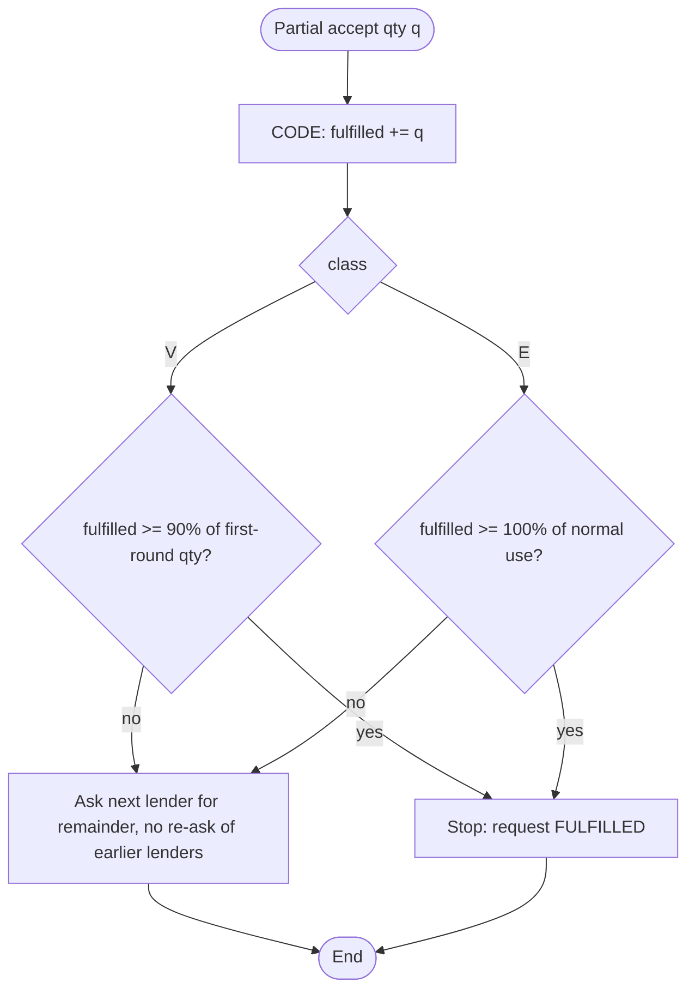
```mermaid
flowchart TD
  A([Partial accept qty q]) --> B["CODE: fulfilled += q"]
  B --> C{class}
  C -- V --> D{fulfilled >= 90% of first-round qty?}
  C -- E --> E{fulfilled >= 100% of normal use?}
  D -- yes --> S["Stop: request FULFILLED"]
  E -- yes --> S
  D -- no --> N["Ask next lender for remainder, no re-ask of earlier lenders"]
  E -- no --> N
  N --> Z([End])
  S --> Z
```
Example (F-20): V first round 120 → stop at 108; E target 21, stop threshold 14 (see §9).

### FL-08 Timeout handling
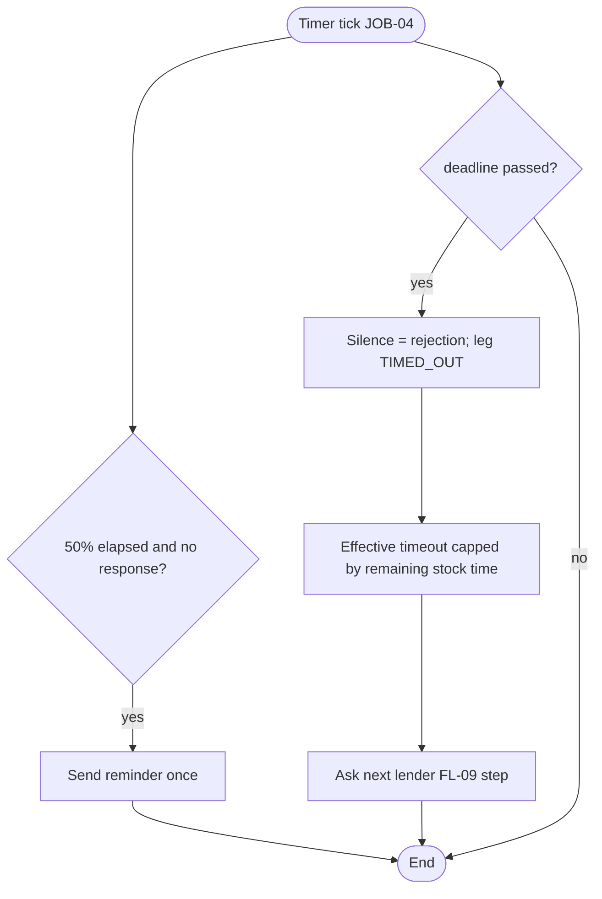
```mermaid
flowchart TD
  A([Timer tick JOB-04]) --> B{50% elapsed and no response?}
  B -- yes --> R["Send reminder once"]
  A --> C{deadline passed?}
  C -- yes --> D["Silence = rejection; leg TIMED_OUT"]
  D --> E["Effective timeout capped by remaining stock time"]
  E --> F["Ask next lender FL-09 step"]
  C -- no --> Z([End])
  R --> Z
  F --> Z
```

### FL-09 Escalation & next-lender
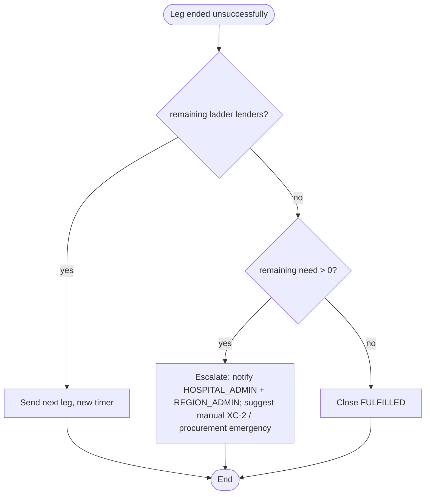
```mermaid
flowchart TD
  A([Leg ended unsuccessfully]) --> B{remaining ladder lenders?}
  B -- yes --> C["Send next leg, new timer"]
  B -- no --> D{remaining need > 0?}
  D -- yes --> E["Escalate: notify HOSPITAL_ADMIN + REGION_ADMIN; suggest manual XC-2 / procurement emergency"]
  D -- no --> F["Close FULFILLED"]
  C --> Z([End])
  E --> Z
  F --> Z
```

### FL-10 Document generation & printing (XC-1)
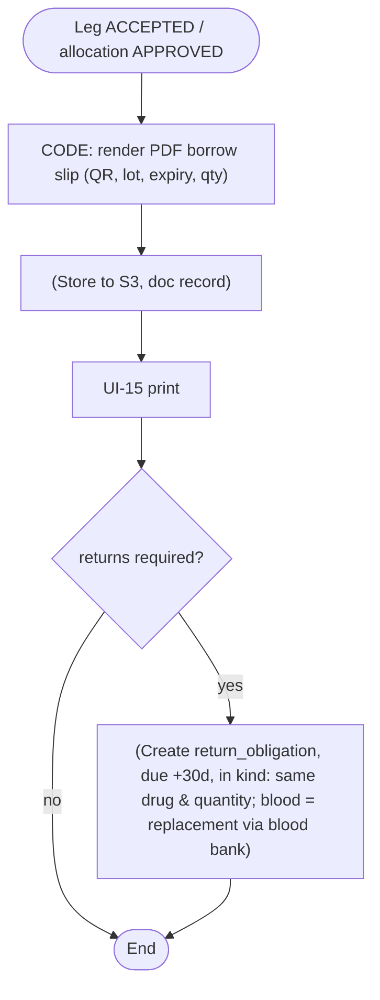
```mermaid
flowchart TD
  A([Leg ACCEPTED / allocation APPROVED]) --> B["CODE: render PDF borrow slip (QR, lot, expiry, qty)"]
  B --> C["(Store to S3, doc record)"]
  C --> D["UI-15 print"]
  D --> E{returns required?}
  E -- yes --> F["(Create return_obligation, due +30d, in kind: same drug & quantity; blood = replacement via blood bank)"]
  E -- no --> Z([End])
  F --> Z
```

### FL-11 Near-expiry release (F2a)
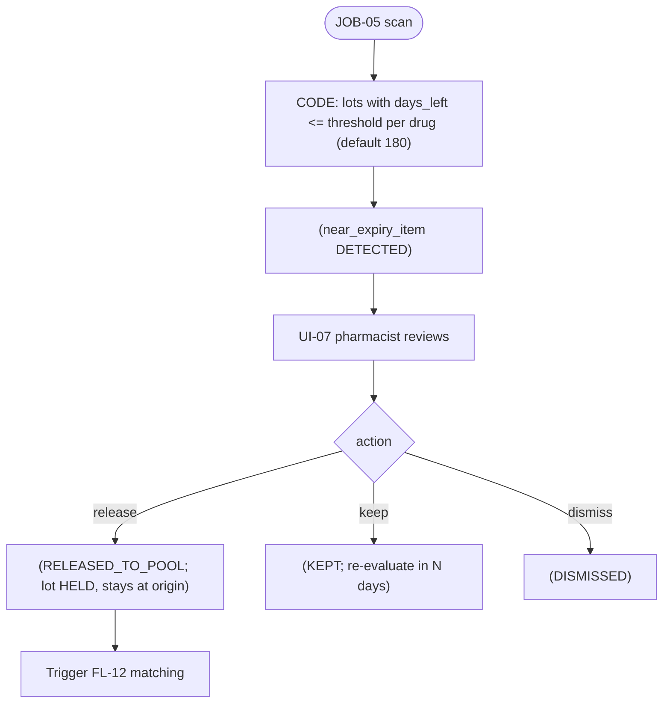
```mermaid
flowchart TD
  A([JOB-05 scan]) --> B["CODE: lots with days_left <= threshold per drug (default 180)"]
  B --> C["(near_expiry_item DETECTED)"]
  C --> D["UI-07 pharmacist reviews"]
  D --> E{action}
  E -- release --> F["(RELEASED_TO_POOL; lot HELD, stays at origin)"]
  E -- keep --> G["(KEPT; re-evaluate in N days)"]
  E -- dismiss --> H["(DISMISSED)"]
  F --> I["Trigger FL-12 matching"]
```

### FL-12 Allocation (matching, splitting, cost check)
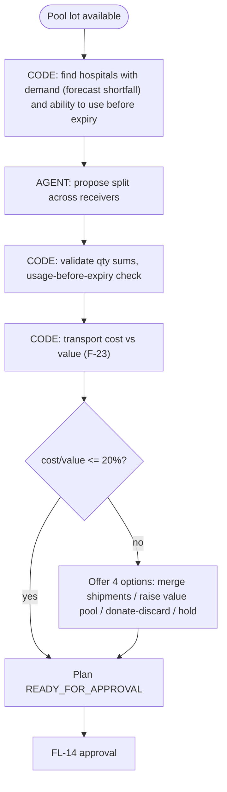
```mermaid
flowchart TD
  A([Pool lot available]) --> B["CODE: find hospitals with demand (forecast shortfall) and ability to use before expiry"]
  B --> C["AGENT: propose split across receivers"]
  C --> D["CODE: validate qty sums, usage-before-expiry check"]
  D --> E["CODE: transport cost vs value (F-23)"]
  E --> F{cost/value <= 20%?}
  F -- yes --> G["Plan READY_FOR_APPROVAL"]
  F -- no --> H["Offer 4 options: merge shipments / raise value pool / donate-discard / hold"]
  H --> G
  G --> I["FL-14 approval"]
```

### FL-13 Manual request (XC-2)
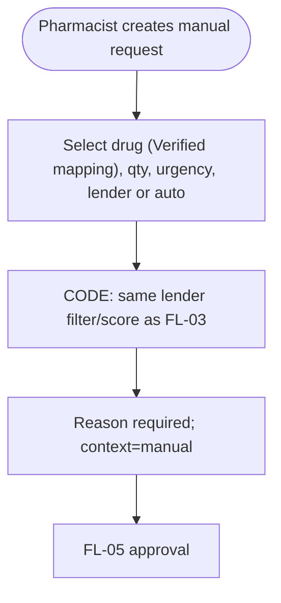
```mermaid
flowchart TD
  A([Pharmacist creates manual request]) --> B["Select drug (Verified mapping), qty, urgency, lender or auto"]
  B --> C["CODE: same lender filter/score as FL-03"]
  C --> D["Reason required; context=manual"]
  D --> E["FL-05 approval"]
```

### FL-14 Approval by involved pharmacists & auto-approve
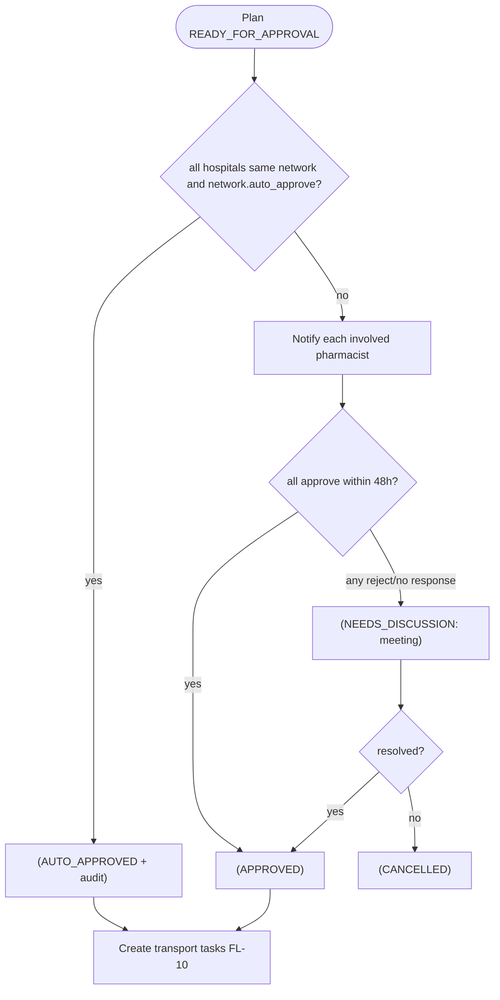
```mermaid
flowchart TD
  A([Plan READY_FOR_APPROVAL]) --> B{all hospitals same network and network.auto_approve?}
  B -- yes --> C["(AUTO_APPROVED + audit)"]
  B -- no --> D["Notify each involved pharmacist"]
  D --> E{all approve within 48h?}
  E -- yes --> F["(APPROVED)"]
  E -- any reject/no response --> G["(NEEDS_DISCUSSION: meeting)"]
  G --> H{resolved?}
  H -- yes --> F
  H -- no --> I["(CANCELLED)"]
  C & F --> J["Create transport tasks FL-10"]
```

### FL-15 Incident intake (F3)
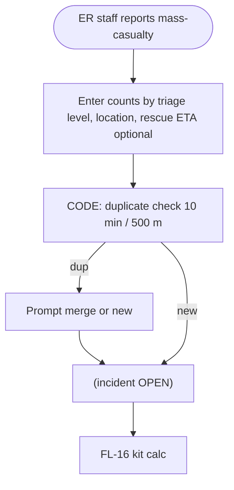
```mermaid
flowchart TD
  A([ER staff reports mass-casualty]) --> B["Enter counts by triage level, location, rescue ETA optional"]
  B --> C["CODE: duplicate check 10 min / 500 m"]
  C -- dup --> C1["Prompt merge or new"] --> D
  C -- new --> D["(incident OPEN)"]
  D --> E["FL-16 kit calc"]
```

### FL-16 Kit & supply calculation
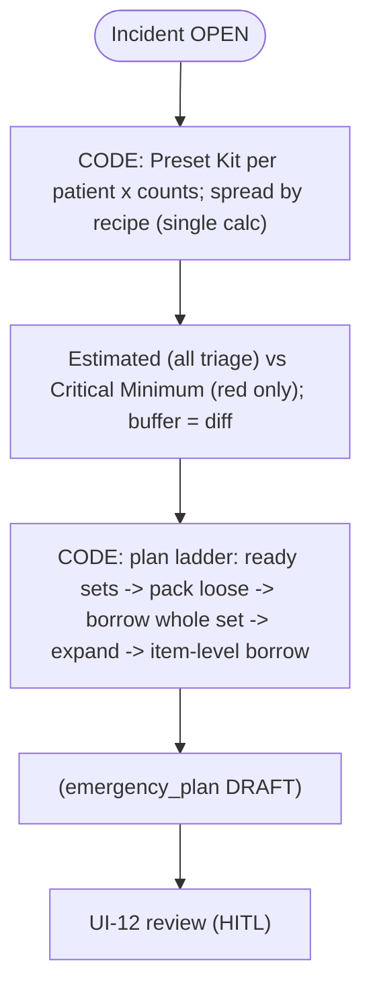
```mermaid
flowchart TD
  A([Incident OPEN]) --> B["CODE: Preset Kit per patient x counts; spread by recipe (single calc)"]
  B --> C["Estimated (all triage) vs Critical Minimum (red only); buffer = diff"]
  C --> D["CODE: plan ladder: ready sets -> pack loose -> borrow whole set -> expand -> item-level borrow"]
  D --> E["(emergency_plan DRAFT)"]
  E --> F["UI-12 review (HITL)"]
```

### FL-17 Emergency borrowing
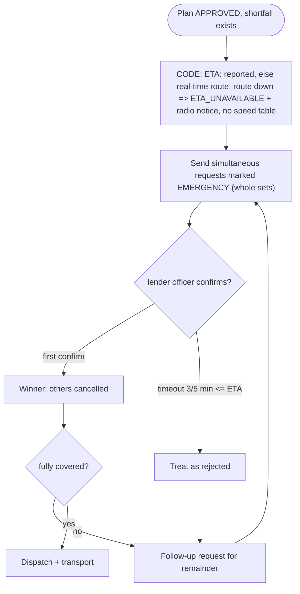
```mermaid
flowchart TD
  A([Plan APPROVED, shortfall exists]) --> B["CODE: ETA: reported, else real-time route; route down => ETA_UNAVAILABLE + radio notice, no speed table"]
  B --> C["Send simultaneous requests marked EMERGENCY (whole sets)"]
  C --> D{lender officer confirms?}
  D -- first confirm --> E["Winner; others cancelled"]
  D -- timeout 3/5 min <= ETA --> F["Treat as rejected"]
  E --> G{fully covered?}
  G -- no --> H["Follow-up request for remainder"]
  G -- yes --> I["Dispatch + transport"]
  F --> H
  H --> C
```

### FL-18 Post-incident reconciliation
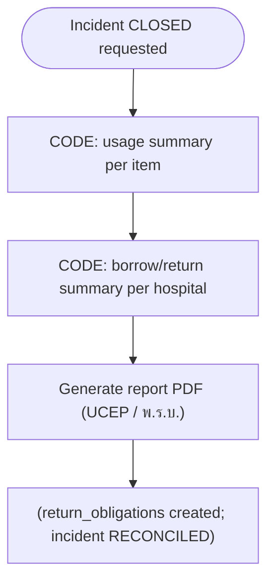
```mermaid
flowchart TD
  A([Incident CLOSED requested]) --> B["CODE: usage summary per item"]
  B --> C["CODE: borrow/return summary per hospital"]
  C --> D["Generate report PDF (UCEP / พ.ร.บ.)"]
  D --> E["(return_obligations created; incident RECONCILED)"]
```

### FL-19 Drug code mapping suggestion
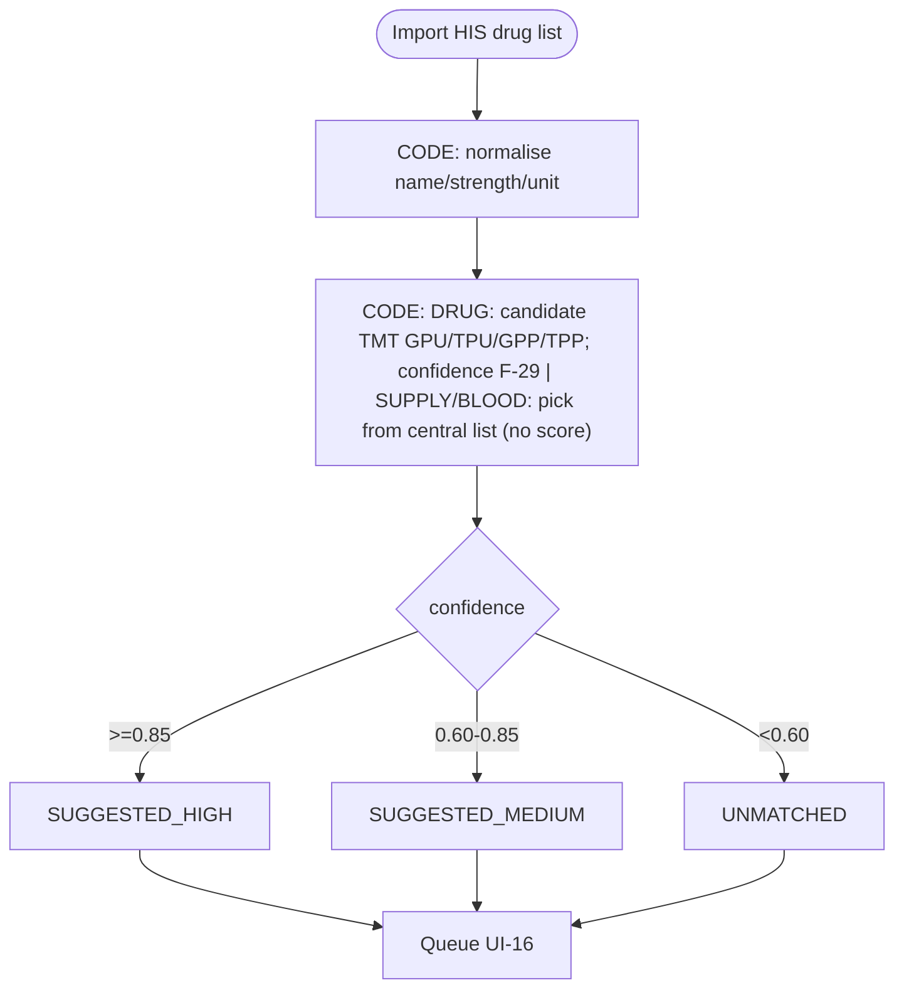
```mermaid
flowchart TD
  A([Import HIS drug list]) --> B["CODE: normalise name/strength/unit"]
  B --> C["CODE: DRUG: candidate TMT GPU/TPU/GPP/TPP; confidence F-29 | SUPPLY/BLOOD: pick from central list (no score)"]
  C --> D{confidence}
  D -- ">=0.85" --> E["SUGGESTED_HIGH"]
  D -- "0.60-0.85" --> F["SUGGESTED_MEDIUM"]
  D -- "<0.60" --> G["UNMATCHED"]
  E & F & G --> H["Queue UI-16"]
```

### FL-20 Mapping verification
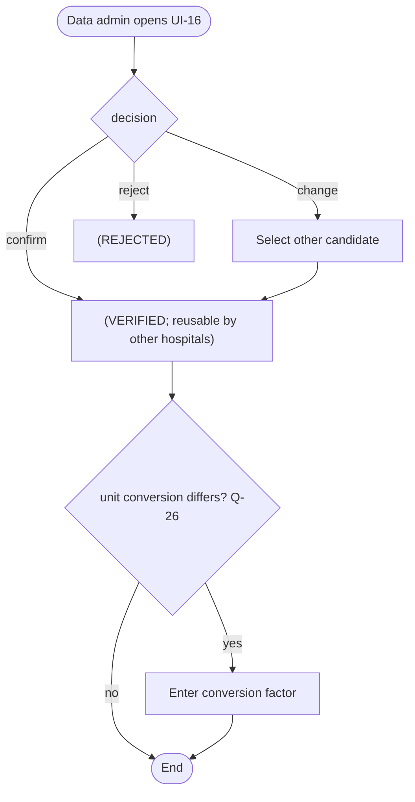
```mermaid
flowchart TD
  A([Data admin opens UI-16]) --> B{decision}
  B -- confirm --> C["(VERIFIED; reusable by other hospitals)"]
  B -- change --> D["Select other candidate"] --> C
  B -- reject --> E["(REJECTED)"]
  C --> F{unit conversion differs? Q-26}
  F -- yes --> G["Enter conversion factor"]
  F -- no --> Z([End])
  G --> Z
```
Only VERIFIED mappings are visible to agents and matching.

---

## 11. State Machines

### SM-1 Borrow request
```mermaid
stateDiagram-v2
  [*] --> DRAFT
  DRAFT --> PENDING_APPROVAL: submit
  PENDING_APPROVAL --> APPROVED: pharmacist approve
  PENDING_APPROVAL --> CANCELLED: reject
  APPROVED --> IN_PROGRESS: first leg sent
  IN_PROGRESS --> PARTIALLY_FULFILLED: partial received
  PARTIALLY_FULFILLED --> IN_PROGRESS: next leg sent
  IN_PROGRESS --> FULFILLED: stop rule met
  PARTIALLY_FULFILLED --> FULFILLED: stop rule met
  IN_PROGRESS --> ESCALATED: ladder exhausted
  ESCALATED --> IN_PROGRESS: manual extra lender
  ESCALATED --> CLOSED_UNFULFILLED: admin close
  DRAFT --> CANCELLED
  APPROVED --> CANCELLED
  FULFILLED --> [*]
  CLOSED_UNFULFILLED --> [*]
  CANCELLED --> [*]
```
| From | To | Trigger | Guard | Side effects | Audit |
|---|---|---|---|---|---|
| DRAFT | PENDING_APPROVAL | submit | borrow>0, ≥1 lender | notify approver | REQ_SUBMITTED |
| PENDING_APPROVAL | APPROVED | approve (HITL) | role PHARMACIST of requester | freeze ladder, send legs | REQ_APPROVED |
| PENDING_APPROVAL | CANCELLED | reject | reason | close alert link | REQ_REJECTED |
| APPROVED | IN_PROGRESS | first leg SENT | — | start timer | LEG_SENT |
| IN_PROGRESS | FULFILLED | stop rule (F-20) | V ≥90%, E ≥100% | close alert, value record | REQ_FULFILLED |
| IN_PROGRESS | ESCALATED | ladder empty & need>0 | — | notify admins | REQ_ESCALATED |

**Leg machine (SM-1b):** `PENDING → SENT → {ACCEPTED, PARTIAL, REJECTED, TIMED_OUT, CANCELLED}`; `ACCEPTED/PARTIAL → LOADED → IN_TRANSIT → RECEIVED`. Stock moves at LOADED (lender) and RECEIVED (borrower) — ASM-13.

### SM-2 Near-expiry item
```mermaid
stateDiagram-v2
  [*] --> DETECTED
  DETECTED --> KEPT: pharmacist keep
  KEPT --> DETECTED: re-evaluate
  DETECTED --> DISMISSED: dismiss
  DETECTED --> RELEASED_TO_POOL: release
  RELEASED_TO_POOL --> ALLOCATED: plan approved
  ALLOCATED --> TRANSFERRED: receipt confirmed
  RELEASED_TO_POOL --> DETECTED: withdraw (no active plan)
  ALLOCATED --> RELEASED_TO_POOL: plan cancelled
  TRANSFERRED --> [*]
  DISMISSED --> [*]
```
Guards: withdraw only if no plan (mutual consent after waiting transport); ALLOCATED lot remains HELD at origin until LOADED.

### SM-3 Emergency incident
```mermaid
stateDiagram-v2
  [*] --> OPEN
  OPEN --> PLAN_REVIEW: plan generated
  PLAN_REVIEW --> ACTIVE: plan approved
  ACTIVE --> ACTIVE: follow-up requests
  ACTIVE --> CLOSE_REQUESTED: ER staff close
  CLOSE_REQUESTED --> RECONCILED: reconciliation done
  OPEN --> CANCELLED: false alarm
  RECONCILED --> [*]
```

### SM-4 Mapping status
```mermaid
stateDiagram-v2
  [*] --> UNMATCHED
  UNMATCHED --> SUGGESTED: candidate found
  SUGGESTED --> VERIFIED: data admin confirm
  SUGGESTED --> REJECTED: reject
  REJECTED --> SUGGESTED: new candidate
  VERIFIED --> SUGGESTED: source data changed (re-verify)
  VERIFIED --> [*]
```

### SM-5 Allocation plan
`DRAFT → READY_FOR_APPROVAL → {AUTO_APPROVED, APPROVED, NEEDS_DISCUSSION} → TRANSPORTING → COMPLETED`; `NEEDS_DISCUSSION → APPROVED | CANCELLED`; `APPROVED → CANCELLED` only while all tasks WAITING_DISPATCH and mutual consent.
```mermaid
stateDiagram-v2
  [*] --> DRAFT
  DRAFT --> READY_FOR_APPROVAL
  READY_FOR_APPROVAL --> AUTO_APPROVED
  READY_FOR_APPROVAL --> APPROVED
  READY_FOR_APPROVAL --> NEEDS_DISCUSSION
  NEEDS_DISCUSSION --> APPROVED
  NEEDS_DISCUSSION --> CANCELLED
  AUTO_APPROVED --> TRANSPORTING
  APPROVED --> TRANSPORTING
  APPROVED --> CANCELLED
  TRANSPORTING --> COMPLETED
  COMPLETED --> [*]
```

### SM-6 Transport task
```mermaid
stateDiagram-v2
  [*] --> WAITING_DISPATCH
  WAITING_DISPATCH --> LOADED: officer + photo
  LOADED --> IN_TRANSIT: driver depart
  IN_TRANSIT --> ARRIVED: driver arrive + photo
  ARRIVED --> RECEIVED: receiver confirm
  WAITING_DISPATCH --> CANCELLED: mutual consent
  RECEIVED --> [*]
```

### SM-7 Return obligation
`OPEN → REMINDED → RETURNED | OVERDUE → RETURNED | WAIVED`; reminders at 7 and 1 days before due; OVERDUE after due date; WAIVED by HOSPITAL_ADMIN with reason.
```mermaid
stateDiagram-v2
  [*] --> OPEN
  OPEN --> REMINDED
  REMINDED --> RETURNED
  REMINDED --> OVERDUE
  OVERDUE --> RETURNED
  OPEN --> WAIVED
  OVERDUE --> WAIVED
  RETURNED --> [*]
```

### SM-8 Stock alert
`OPEN → ACKNOWLEDGED → LINKED_TO_REQUEST → RESOLVED`; `OPEN/ACKNOWLEDGED → SNOOZED → OPEN`; `* → AUTO_CLOSED` when stock recovers above ROP.
```mermaid
stateDiagram-v2
  [*] --> OPEN
  OPEN --> ACKNOWLEDGED
  ACKNOWLEDGED --> LINKED_TO_REQUEST
  LINKED_TO_REQUEST --> RESOLVED
  OPEN --> SNOOZED
  SNOOZED --> OPEN
  OPEN --> AUTO_CLOSED
  ACKNOWLEDGED --> AUTO_CLOSED
  RESOLVED --> [*]
  AUTO_CLOSED --> [*]
```
All state changes are written by a single service function `transition(entity, to_state, actor, reason)` that checks the table above, writes `audit_log`, and emits a domain event (REQ-STATE-001).

